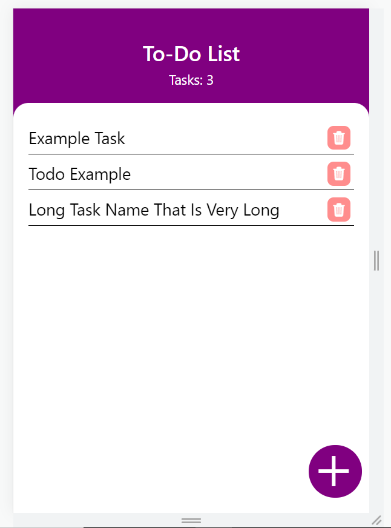
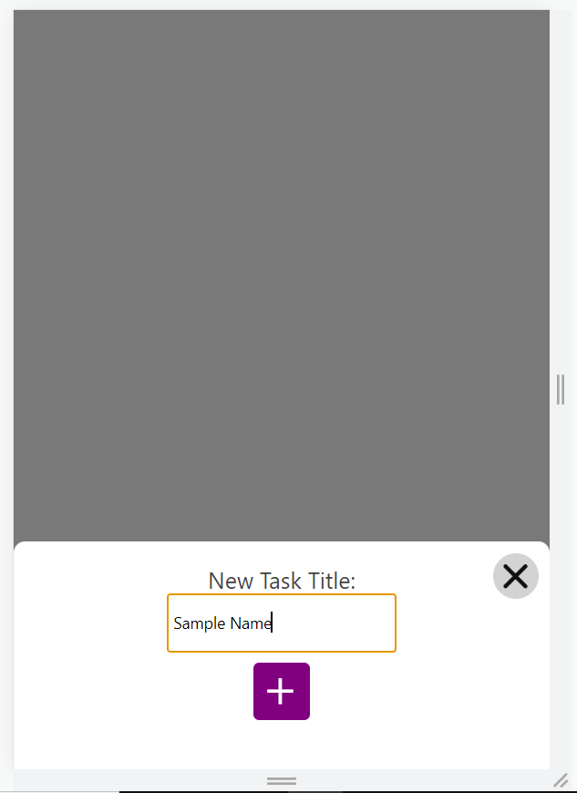

# Hack Technology / Project Attempted

## What you built? 

### Project 1: React Native Introduction

#### Description

The first project was a basic introduction to the React Native kit. The end product was a list of countries fetched by an API which, when clicked on, will display an alert with the country's capital. Most of the time for this first project was spent on downloading the tools, learning the basics, and fiddling around with React Native.

#### Screenshots

### Project 2: React Native + Redux

#### Description

The goal of this project was to use Redux (a state management library) to create a To-Do app with navigation through multiple pages. This involved creating multiple views, as well as implementing a store and a reducer. The majority of the time for this project was spent on trying to understand how each of the pieces were interacting with each other.

#### Screenshots

### Project 3: React Native Gradients

#### Description

The goal of this project was to learn a bit more about styling in React Native through applying a background of a linear gradient placed over top of an image. React Native has its own linear gradient library which was imported into the Redux hack. Most of the time for this project was spent on styling.

#### Screenshots

## Who Did What?

I worked on this by myself!

## What you learned

I learned how to create a basic React Native mobile app, how to use Redux to implement a state management system within a React Native app, and how to apply styling through the linear gradient library. All three of my mini-hacks worked well, and I had fun implementing them! This will certainly be useful groundwork for any CS98 project which decides to go down the mobile route (which I imagine will be many)!

The only thing I struggled to get working was simulating the app on my iPhone. I do not have a Mac, so running Xcode was not an option. I got the first project to work on my phone using tunneling and the Expo app, but was unable to get the second and third projects to simulate. Thus, I used the web simulation and a mobile formatting to test these latter projects!

## Authors

Quinn Spraut - quinn.a.spraut.22@dartmouth.edu

## Acknowledgments

[React Native Introduction](https://www.instamobile.io/react-native-tutorials/build-react-native-app/)

[React Native Redux](https://www.instamobile.io/mobile-development/react-native-redux/)

[React Native Gradients](https://www.instamobile.io/mobile-development/gradients-react-native/)
